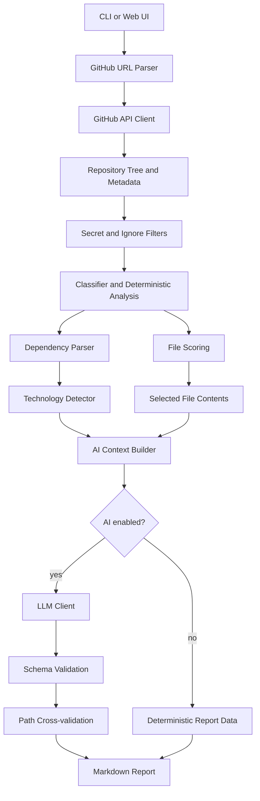

# RepoLens

RepoLens is a CLI-first Python tool that explains public GitHub repositories using deterministic static analysis plus an optional LLM pass. It accepts a GitHub repository URL, fetches metadata and a repository tree through the GitHub API, filters and classifies files, ranks the files that are most useful to read first, detects dependencies and technologies, builds a bounded and sanitized AI context, validates structured LLM output, and produces a Markdown report.

## Problem

Large repositories are hard to understand quickly. Sending an entire repository to an LLM is expensive, noisy, and unsafe: most files are irrelevant, secret-like files may be present, generated or binary files waste context, and malicious repository text can attempt prompt injection.

## Solution

RepoLens does deterministic work first. It counts facts, filters paths, classifies files, parses dependency manifests, ranks important files, and applies security controls before any LLM is called. The LLM receives only a compact, labeled context and its JSON output is schema-validated before it appears in a report.

## Why RepoLens Exists

RepoLens is designed as a portfolio-quality repository intelligence tool that demonstrates API integration, static analysis, security boundaries, deterministic testing, LLM grounding, and clean CLI ergonomics without executing untrusted code.

## Features

- GitHub URL parsing and validation for public repositories.
- GitHub REST API client for metadata, recursive trees, content, rate limits, retry, and partial huge-repo fallback.
- Whole path-component ignore filtering.
- File classification for source, tests, config, docs, dependencies, CI/CD, infrastructure, generated, binary, assets, and unknown files.
- Binary and encoding-safe content inspection.
- Deterministic repository statistics.
- File importance scoring with deterministic tie-breaking.
- Dependency manifest parsing for Python, JavaScript/TypeScript, Java, Go, Rust, .NET, PHP, and Ruby.
- Evidence-based technology detection with confirmed, likely, and possible confidence levels.
- Secret path exclusion and content redaction before AI context construction.
- Token-budgeted context builder with explicit file delimiters.
- Anthropic-compatible LLM client behind a small interface.
- Pydantic schema validation, one recovery attempt, and path cross-validation.
- Markdown report generation.
- `--interview` mode for repository-specific interview questions.
- `--no-ai` deterministic-only mode.
- Optional Flask web UI that reuses the same pipeline.

## How RepoLens Works

1. Parse and validate the GitHub URL.
2. Fetch repository metadata and tree from GitHub.
3. Remove secret-like paths and ignored directories.
4. Classify files and compute deterministic statistics.
5. Fetch and parse the top prioritized supported dependency manifests within the configured API budget.
6. Rank non-binary, non-excluded files by importance.
7. Fetch only the top-ranked file contents within configured size limits.
8. Detect technologies from dependency, file, directory, and import evidence.
9. Build a bounded, sanitized, delimited AI context.
10. In AI mode, call the LLM and validate structured JSON.
11. Drop hallucinated AI file paths that are not in the actual filtered tree.
12. Render a Markdown report.

## Architecture Overview



The CLI and optional web UI both call the same `repolens.pipeline.run_analysis()` orchestration function. The web layer is intentionally thin and does not duplicate analysis logic.

## Security Model

RepoLens treats repository content as untrusted data. It never executes target repository code, never installs target dependencies, never runs target scripts, and never places repository content in the system prompt.

Security controls include:

- GitHub URL validation restricted to `github.com` / `www.github.com` repository URLs.
- A fixed GitHub API base URL rather than arbitrary user-provided hosts.
- Secret-like path exclusion before selected file content is fetched.
- Redaction for common secret-looking values in selected safe files.
- Explicit `<<<FILE:path>>>` / `<<<END_FILE>>>` delimiters around repository content.
- Separate trusted system prompt and untrusted repository context.
- Token and file-size limits before LLM calls.
- Pydantic validation for structured LLM output.
- Cross-validation that drops AI-referenced paths missing from the filtered tree.

Residual risks remain: secret detection is heuristic, token estimation is approximate, and LLM explanations depend on selected context and provider output.

## Technology Stack

- Python 3.11+
- `httpx` for GitHub and LLM HTTP calls
- `pydantic` for structured LLM output validation
- `python-dotenv` for environment configuration
- `Flask` for the optional web UI
- `pytest` for unit and integration tests

## Installation

```bash
python -m venv .venv
.venv\Scripts\activate
pip install -e .
```

On macOS/Linux, activate with:

```bash
source .venv/bin/activate
```

## Configuration

Copy `.env.example` to `.env` and set values as needed.

```env
GITHUB_TOKEN=
LLM_PROVIDER=anthropic
LLM_API_KEY=
LLM_MODEL=claude-sonnet-4-6
MAX_FILES_ANALYZED=12
MAX_FILE_SIZE_BYTES=15000
MAX_CONTEXT_SIZE=12000
REQUEST_TIMEOUT=10
MAX_RETRIES=3
LOG_LEVEL=INFO
```

`GITHUB_TOKEN` is optional for public repositories but helps avoid unauthenticated GitHub rate limits. `LLM_API_KEY` is required for AI mode. Use `--no-ai` for deterministic-only reports without an LLM key.

## CLI Usage

```bash
repolens analyze <repository-url> [options]
```

Options:

```text
--output PATH          Output file path, or - for stdout
--format {md,json}     Output format
--interview            Add interview questions
--no-ai                Skip LLM analysis
--max-files N          Override MAX_FILES_ANALYZED
--max-file-size N      Override MAX_FILE_SIZE_BYTES
--verbose              Debug logging to stderr
```

Examples:

```bash
repolens analyze https://github.com/pallets/flask --no-ai --output flask_report.md
repolens analyze https://github.com/axios/axios --no-ai --format json --output axios_report.json
repolens analyze https://github.com/rust-lang/rust --interview --output rust_report.md
```

## Example Report Sections

A generated Markdown report includes:

- Summary
- Project purpose
- Repository metadata
- Deterministic overview
- Language distribution
- Technology stack
- Dependencies
- Architecture
- Folder-by-folder breakdown
- Top files to read first
- Reading order
- Entry points
- Code flows
- Testing summary
- Configuration summary
- Suggested improvements
- Interview questions when requested
- Analysis limitations

## AI and LLM Architecture

The LLM is optional. When enabled, RepoLens sends one structured request containing metadata, deterministic stats, repository structure, selected file contents, parsed dependencies, and technology evidence. File contents are delimited as data and capped by `MAX_CONTEXT_SIZE`. The response must be JSON matching `RepoAnalysis` in `repolens/ai/schema.py`; invalid JSON triggers one bounded recovery attempt.

## Optional Web UI

A thin Flask wrapper is available:

```bash
python -m webapp.app
```

Open `http://127.0.0.1:5000`, enter an `https://github.com/owner/repo` URL, and submit. The web UI calls `repolens.pipeline.run_analysis()` and does not duplicate analysis logic. If `LLM_API_KEY` is absent, the web route uses deterministic-only analysis.

## Testing

Run the full suite:

```bash
pytest
```

Run targeted areas:

```bash
pytest tests/unit/test_scoring.py tests/integration/test_scoring_engine.py
pytest tests/integration/test_prompt_injection.py
pytest tests/integration/test_full_pipeline.py
pytest tests/unit/test_webapp.py
```

Tests are offline and deterministic. Unit and integration tests mock GitHub and LLM behavior.

## Project Structure

```text
repolens/
  ai/                  context builder, prompts, LLM client, schema validation
  analyzer/            filtering, classification, deterministic stats, scoring, tech/dependency detection
  github/              URL parsing, GitHub API client, rate-limit handling
  report/              Markdown and interview report generation
  security/            secret filtering and redaction
  cli.py               argparse entry point
  config.py            environment configuration
  pipeline.py          end-to-end orchestration
webapp/
  app.py               optional Flask web UI
  templates/           minimal HTML templates
tests/
  unit/                pure unit tests
  integration/         mocked integration tests
  fixtures/            sample repository trees
```

## Engineering Decisions

RepoLens keeps the design deliberately small and auditable:

- GitHub API instead of cloning: fetch metadata, trees, and selected files without local checkouts or repository hooks.
- Static analysis only: parse paths, manifests, and text as data without executing target code.
- Deterministic prioritization before AI: rank files by explainable signals before spending context.
- Structured LLM output: require schema-valid JSON and one bounded recovery attempt.
- Bounded context: cap files, bytes per file, and total prompt size.
- Security-first prompt design: repository content stays in user/context data, never in system instructions.

## Limitations

- Public GitHub repositories only.
- No GitLab or Bitbucket support.
- No private repository OAuth flow.
- Single LLM provider implementation for MVP.
- Token estimation is approximate.
- Huge GitHub trees may be partial if GitHub truncates recursive tree responses.
- GitHub URLs with slash-containing branch names are only partially supported; repository-root URLs use the default branch and are the recommended input.
- Repositories with many manifests parse a prioritized subset to avoid excessive GitHub API calls.
- Secret redaction is heuristic and cannot prove every possible secret format is removed.
- AI summaries depend on the selected files and validated provider output.

## Future Improvements

- Persistent cache keyed by repository and commit SHA.
- Multi-provider LLM support.
- Grounded chat mode over the generated analysis context.
- GitLab/Bitbucket support behind a VCS client interface.
- Richer dependency parsers for lockfiles.
- More polished web UI deployment package.